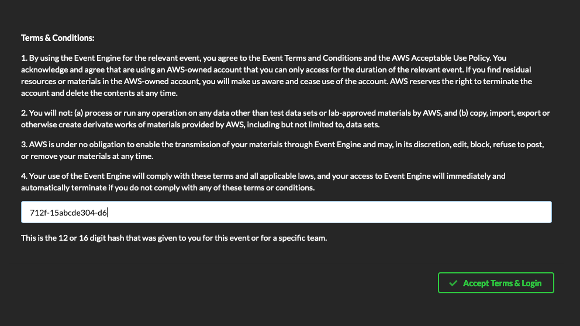
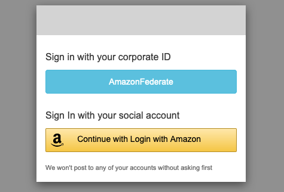
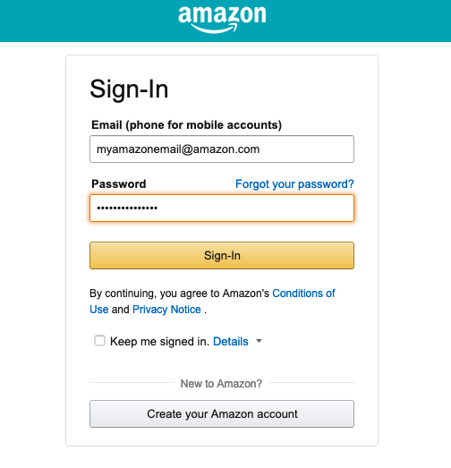
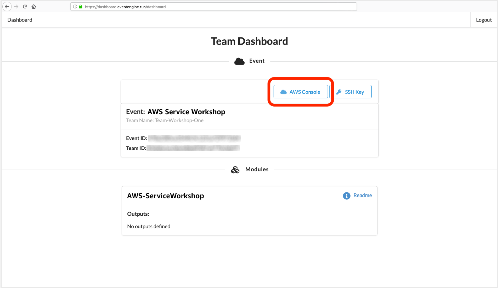

# Module 0: Event Engine Login

**Time to complete:** 5 minutes

In this pre-module, we will go over how to use the AWS Event Engine platform and how to get into your account. AWS Event Engine vends AWS accounts that are fully owned by AWS. They are active only for the duration of the event. In the event that you would like to continue the labs afterwards, you will have to start over on your own account.

# STOP! If you're not attending an AWS Workshop where AWS is providing accounts, click [here to skip this pre-module](../module-1). You'll need your own AWS account to proceed.

### Getting Started

As part of the AWS Event, AWS staff will provide you with an event hash that looks like *712f-15abcde304-d6*. This code is unique to each event. The platform will prompt you to log into your Amazon.com consumer account, but it is simply for authentication. The platform will not create anything under your name nor will it charge you anything. If you do not feel comfortable using your Amazon.com consumer account for authentication, you are free to create an AWS account of your own and run the workshop separately.

1. Navigate to [https://dashboard.eventengine.run](https://dashboard.eventengine.run).

2. Enter the event hash and hit **Accept Terms & Login**

3. Click **Continue with Login with Amazon**

4. Enter in your Amazon.com credentials. *Note: Reminder - you will not be charged for anything. This is simply for authentication**

*If you get any errors, it's potentially because the event hasn't started yet. Please be patient.*

5. Once logged in, you should see your event listed on the page. Click on **AWS Console**.

6. On the next page, click **Open AWS console** to launch the AWS management console. You will not need API key/secret for this workshop, but it's good to note down in case you want to use the CLI to do things like describe calls.

# Checkpoint

You have now logged into your AWS Account. [Proceed to Module 1](../module-1)
